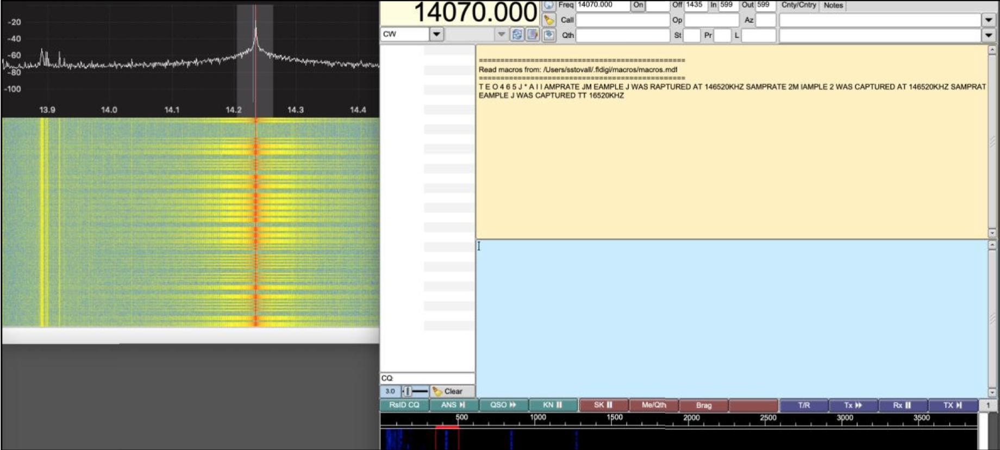
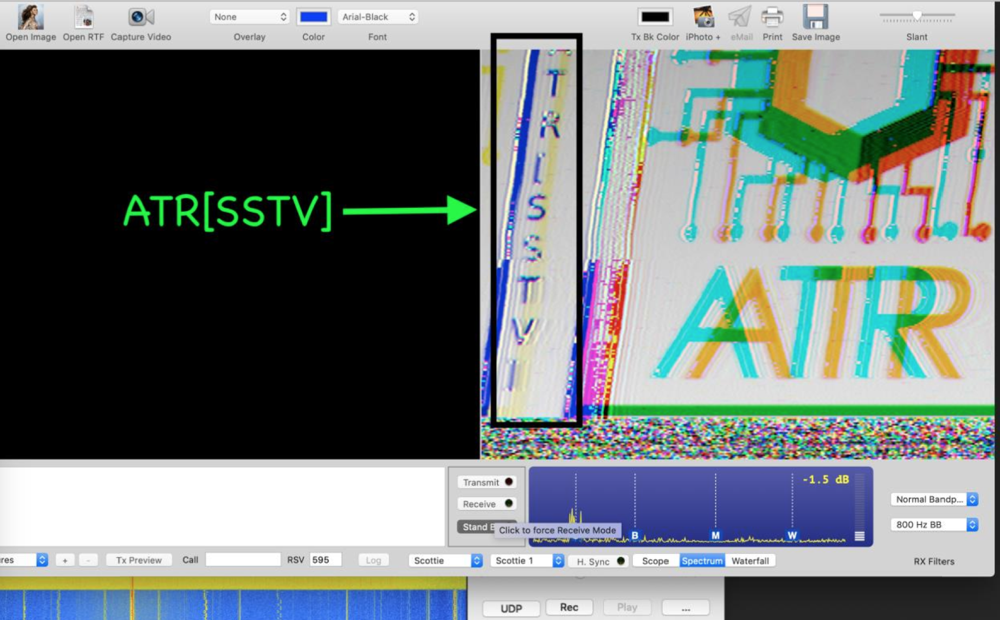

# Solution Write Up to Smell Like Ham to You?

The first clue is 50.090Mhz given in the filename (1_2Msps_50.090MHz_2MHz.iq). A ham radio 
operator would expect CW at 50.090Mhz in the 6M band.
The first tool will be GQRX convert the “.iq” files to audio.

[http://gqrx.dk](http://gqrx.dk)

With the morse code identified, fldigi can be used to decode the morse code.
[http://www.w1hkj.com/files/fldigi/](http://www.w1hkj.com/files/fldigi/)

Sample 1 CW Decoded: SAMPLE 2 WAS CAPTURED AT 146520KHZ SAMPRATE 2M

**Figure:** Sample 1 Morse Code decode with fldigi

With the second clue, I expect FM simplex at 146.520Mhz on the 2M band. This was close, 
although it turned out that AM voice was discovered. This was played with GQRX.

This clue provided: "THE THIRD FILE WAS CAPTURED AT 7.171MHZ AND 2.5MSPS"

For Sample 3, this is expected to be 7.171Mhz of the 40M ham radio band.
[https://en.wikipedia.org/wiki/Amateur_radio_frequency_allocations](https://en.wikipedia.org/wiki/Amateur_radio_frequency_allocations)

At 7.171Mhz, we expect CW, RTTY, data, phone and image. As a ham radio operator, I expected 
this may be SSTV. I compared some known waterfalls and audio samples to further confirm that this is SSTV.
[http://www.hfradio.org.uk/html/digital_modes.html](http://www.hfradio.org.uk/html/digital_modes.html)

Finally, with GQRX playing the “.iq” sample, I decoded the SSTV via MultiScan 3B 
\(Scottie/Scottie1\).
\(MultiScan 3B: [https://www.qsl.net/kd6cji/](https://www.qsl.net/kd6cji/)\)

At first, the center frequency tuning was slightly off. A second decode yielded better results providing the flag.

**Figure:** Sample 3 GQRX and SSTV decoding via MultiScan 3B