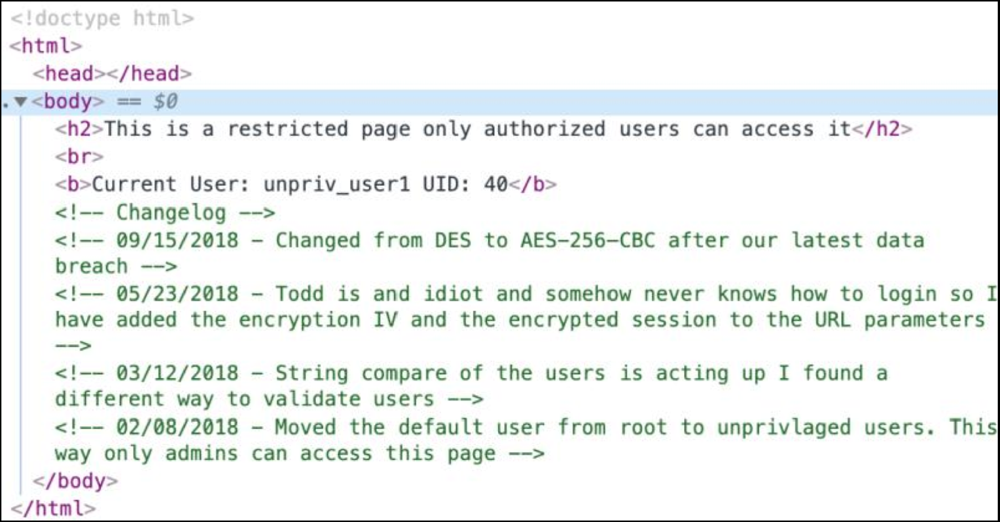
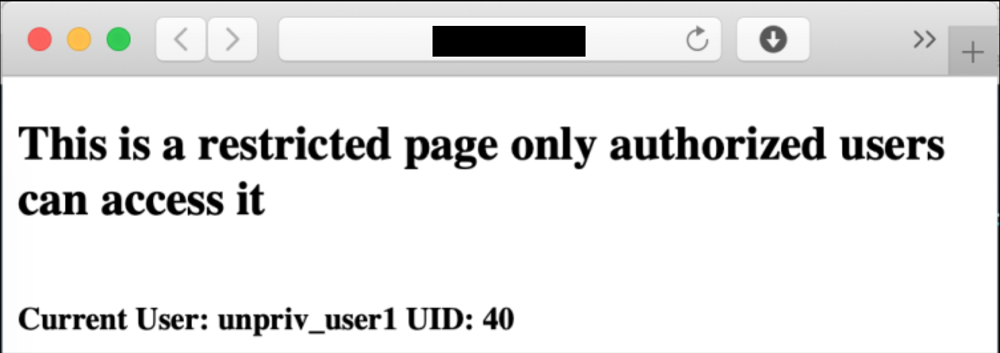
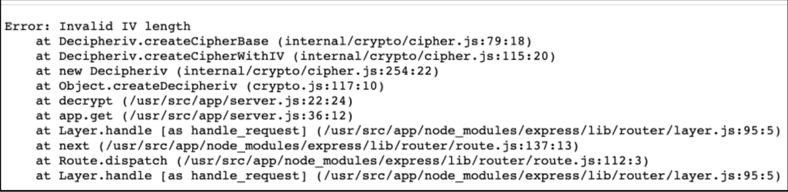
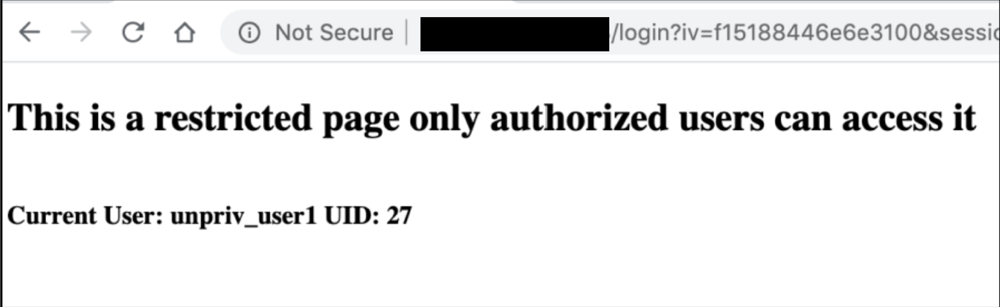
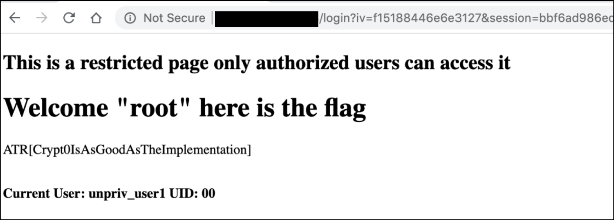

# Solution Write Up to I've Seen Sites Like This Before!

Upon loading link 1, there appear to be some clues in the HTML source code.

**Figure:** Developer comments in HTML source code

**Figure:** Error message displayed via link1

By manipulating the “iv=” parameter, we get addition error output.

**Figure:** Error output “invalid IV length”

By changing the last two digits of the “iv” parameter to 00, the UID changes to 27.

iv=f15188446e6e3100

**Figure:** UID changed to 27

By changing the last two digits of the “iv” parameter to 27, the flag was revealed!

