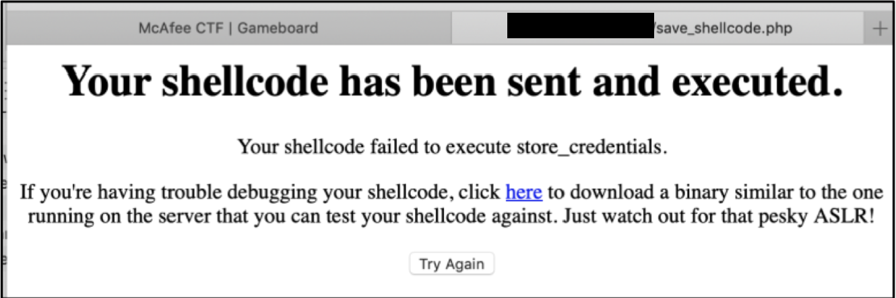
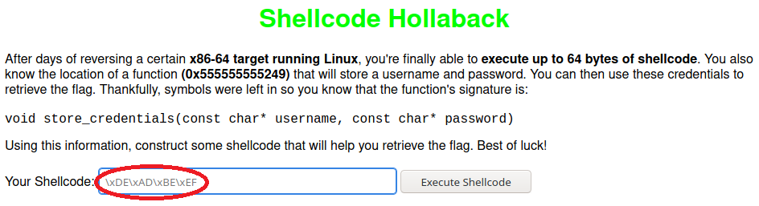
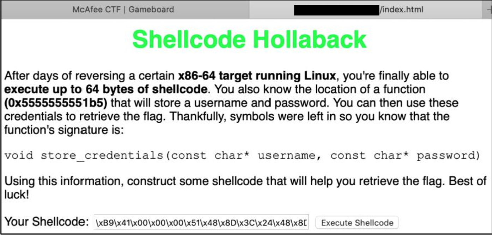
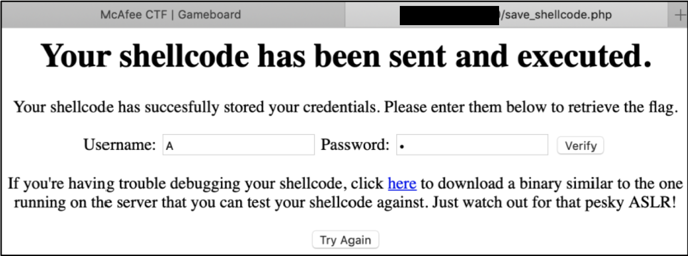

# Solution Write Up for Shellcode Hollaback

## Getting a Binary to Test Against

Upon an invalid submission, the `shellcode_tester` binary can be downloaded, which is similar to the code used by the server to process your shellcode when submitted through the web page. This will be useful for testing/debugging your shellcode locally before attempting a submission through the web page:


## Writing the Assembly Instructions

**NOTE: A introductory guide to writing shellcode can be found [here](https://nobe4.fr/shellcode-for-by-newbie/). Make sure you utilize the [correct calling convention for the architecture/platform specified (x86-64 Linux)](https://defuse.ca/online-x86-assembler.htm).**

Our first task is to write x86-64 assembly instructions that will call the `store_credentials()` function with a username and password we control. According to Wikipedia, Linux running on x86-64 uses the System V ARM64 ABI calling convention, and in this convention the first paramter passed to a function is stored in the RDI register and the second is stored in the RSI register. Thus, in our assembly, RDI will need to point to the username and RSI will need to point to the password. To conserve space, we can use a single letter for the username argument and re-use the same variable for the password. A single “A” can be stored in the RCX register by calling `mov rcx, 0x41`, since `0x41` is the ASCII code for "A" in hexidecimal. Since `store_credentials()` expects as arguments *pointers* to strings, a good next step would be to push our "A" onto the stack using `push rcx`, which will give us a pointer to it automatically in the form of the stack pointer (RSP). From there, we simply copy this pointer into RDI and RSI using `mov rdi, rsp` and `mov rsi, rsp`, respectively. Finally, we call the `store_credentials()` function by first setting RAX to its location in memory using `movabs rax, 0x555555555309` and then jumping to that location using `jmp rax`. All together, the assembly should look like:

```assembly
movabs rdi, 0x41
push rdi
mov rdi, rsp
mov rsi, rsp
movabs rcx, 0x555555555309
call rcx
```

**NOTE: In this case, `store_credentials()` was located at the address `0x555555555309` for `shellcode_tester`, but it may be different for you. When writing your shellcode, make sure to use the address specified by your `shellcode_tester` binary when you run it.**

## Converting the Assembly to Shellcode

The shellcode input field on the webpage seems to indicate that the solution should be in the form of a hex string literal, not assembly instructions:


Thus, we have to assemble the assembly instructions we wrote and convert the result to a hex string literal. An easy way to accomplish this is to use the [Defuse Online x86/x64 Assembler](https://defuse.ca/online-x86-assembler.htm#disassembly), which will output, among other things, a string literal matching the format we want. Just make sure that the "x64" radio button is selected before you hit "Assemble":


## Testing the Shellcode Locally

Once we have our shellcode as a hex string literal, we can test it against the `shellcode_tester` binary we obtained earlier by simply pasting the string at the `Enter shellcode:` prompt and then checking the contents of the generated `output.txt` file:


If you've crafted your shellcode correctly, `output.txt` should contain your username followed by your password, seperated by a newline. In our case, we used an "A" for both the username and the password, so it looks like it worked as expected!

## Submitting Your Solution and Getting the Flag

All that's left to do now is modify the shellcode to use the `store_credentials()` address specified on the webpage (which may be different from the one given by `shellcode_tester`), enter it in the text field, and hit "Execute Shellcode":


At the next page, you should see a prompt asking you to enter your credentials. We'll simply enter "A" for both and hit "Verify":


Success! Flag retrived.

