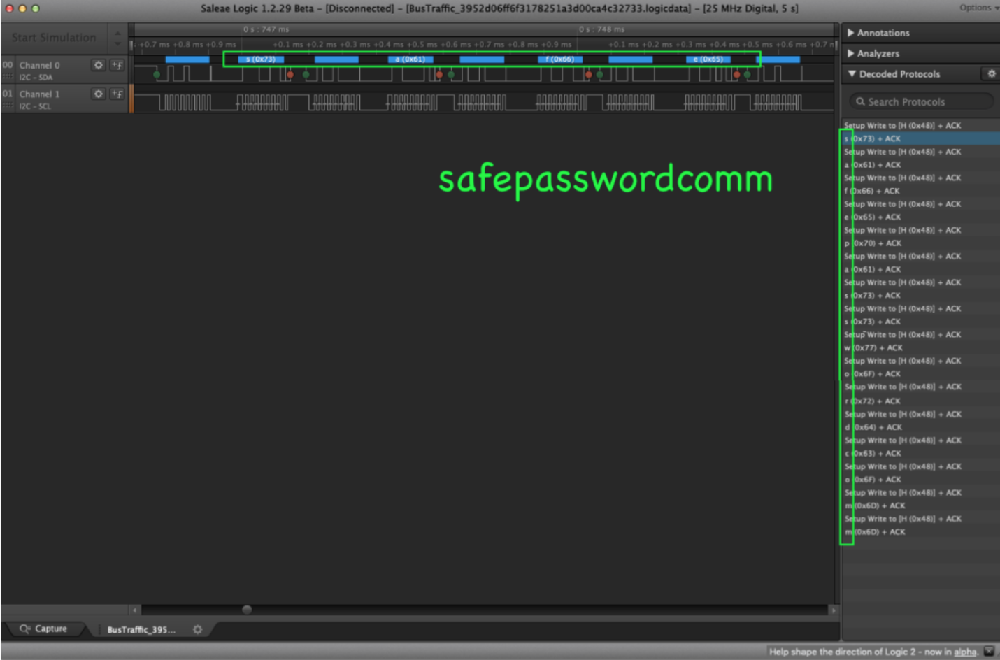
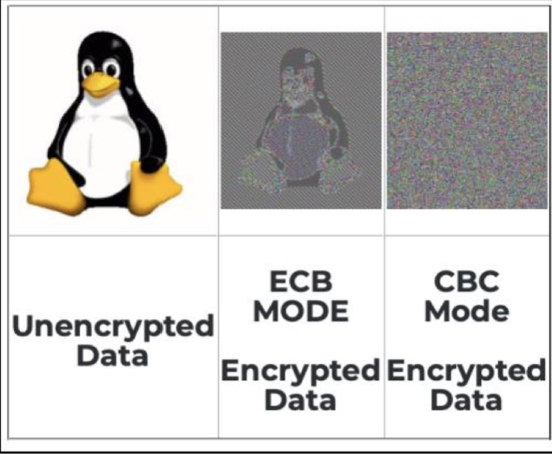
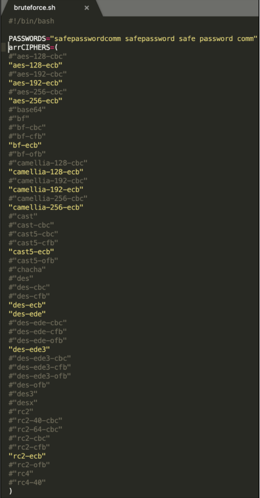
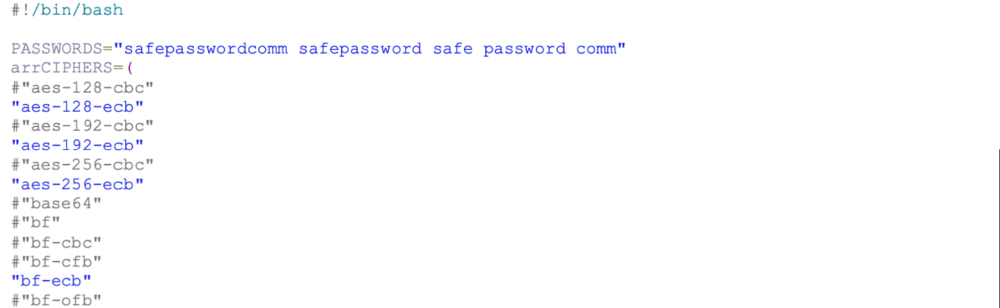
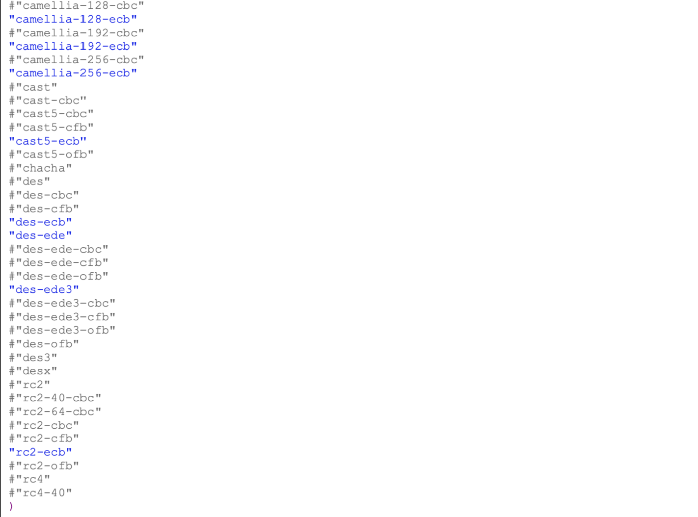

# Solution Write Up Not Shack the Secret

1. Load the buslogic log to saleae Sofware [https://www.saleae.com/downloads/](https://www.saleae.com/downloads/)
2. Using the I2C protocol analyzer, we can see the result below of the traffic


**Figure:** Saleae I2C protocal analyzer decoding the transmitted password

3. Analyze the ciphertext to determine any clues for the encryption algorithm. The hexdump 
indicates that the ciphertext was encrypted with Openssl with a salted password. There are 
16 byte data chunks with a repeating pattern.


**Figure:** Hexdump of encrypted blob

The repeating pattern gives a clue that the encryption used is likely ECB rather than CBC. Since there are only 112 bytes of data, this is unlikely an image. The algorithm must be bruteforced, but this clue greatly reduces the pool of possible encryption algorithms.



**Figure:** Comparison of AES ECB vs CBC mode encryption

[https://datalocker.com/what-is-the-difference-between-ecb-mode-versus-cbc-mode-aes-encryption/](https://datalocker.comwhat-is-the-difference-between-ecb-mode-versus-cbc-mode-aes-encryption/)

[https://codisec.com/ctfzone-2017-decrypt-undecryptable/](https://codisec.com/ctfzone-2017-decrypt-undecryptable/)



**Figure:** bruteforce.sh: Illustrates the algorithms eliminated based upon ECB vs CBC.




**Table:** Source code of bruteforce.sh

After running ./bruteforce.sh to create 180 possible decryptions, the flag was found.

```
grep -ir atr *
.txt
./flag-aes-128-ecb-sha256-
safepasswordcomm.txt:ATR[HWHackIsFun]3flagrepeats4youATR[HWHackIsFun]Reallypoorcrypto-ECBsnotforfilesATR[HWHackIsFun]
```

Based upon the naming convention utilized by bruteforce.sh, it can be determined that the encrypted blob was encrypted via AES-128 with SHA256.