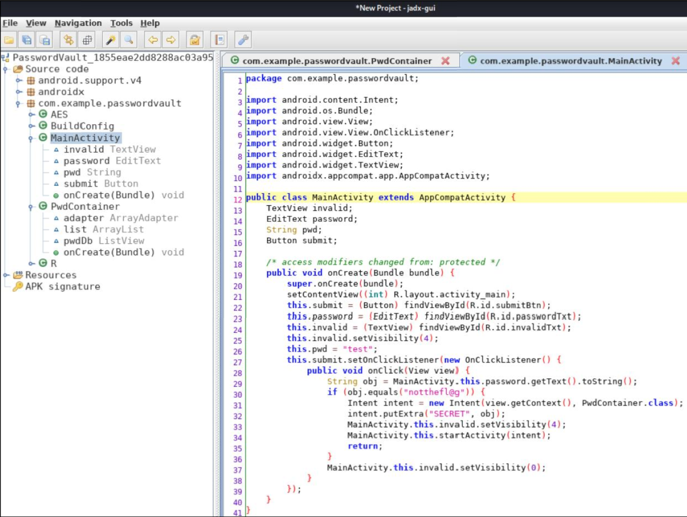
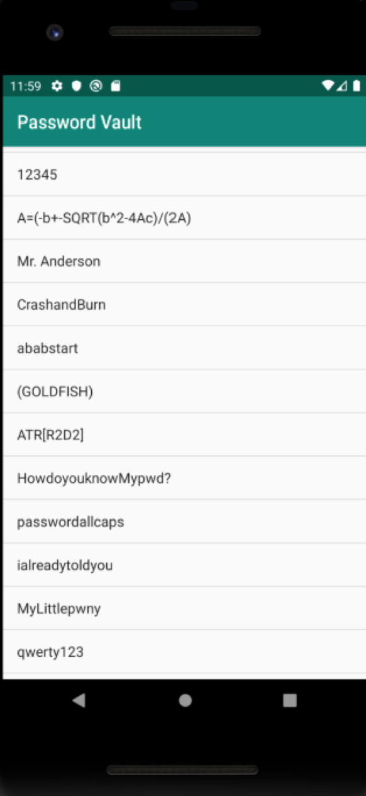
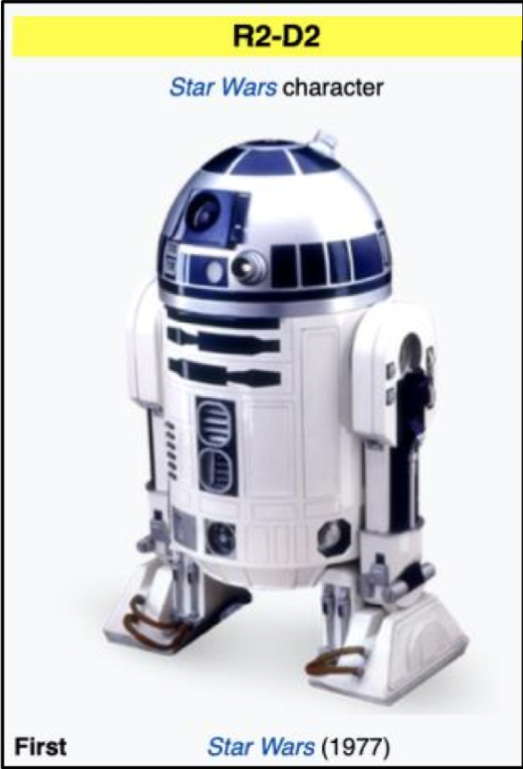

# Solution Write Up to Looking For Droids

Run the Android Studio emulator to examine PasswordVault_1855eae2dd8288ac03a95235eb44bc0c.apk provided by CTF.
[https://developer.android.com/studio](https://developer.android.com/studio)

**Figure:** PasswordVault App displaying invalid password

Load the apk into jadx-gui to review the decompiled source code and see if it is possible to determine the password. The password appears to be “notthefl@g”.
[https://github.com/skylot/jadx](https://github.com/skylot/jadx)

**Figure:** jadx-gui MainActivity decompiled source code

After entering the password for the Password Vault, it appears the flag has been discovered — ATR[R2D2].

**Figure:** PasswordVault unlocked with flag listed

**Figure:** R2-D2 – not the droids you are looking for [https://en.wikipedia.org/wiki/R2-D2](https://en.wikipedia.org/wiki/R2-D2)