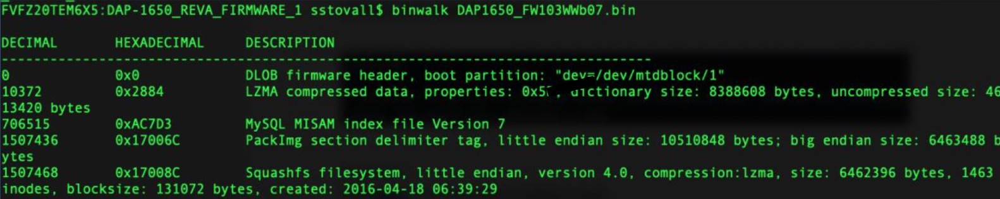
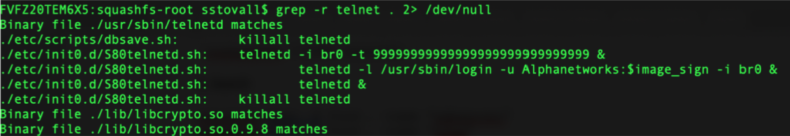
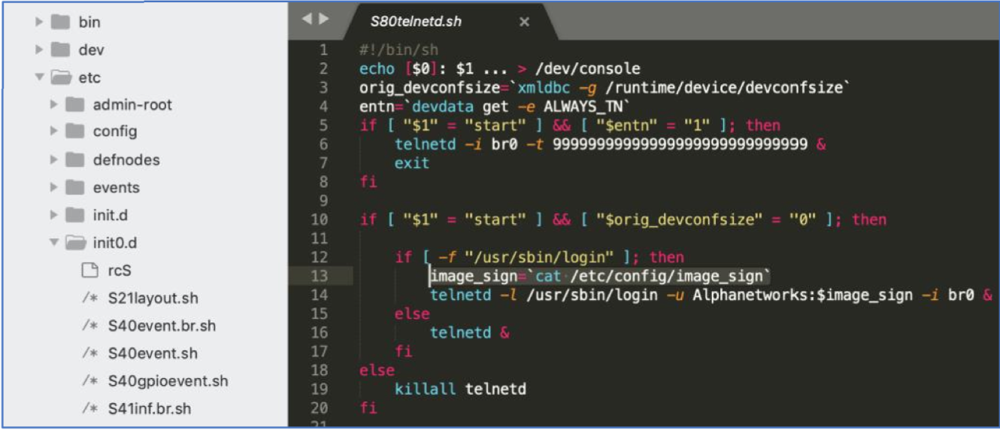
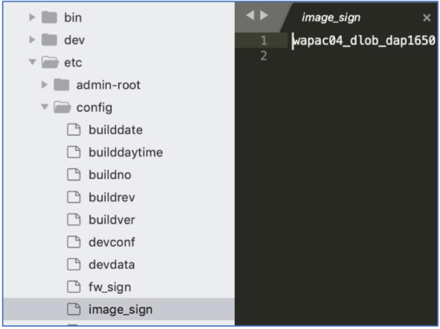

# Solution Write Up to A Picture is Worth a Thousand Vulns

- Determine more information about architecture:
	- [https://forum.openwrt.org/t/any-plans-for-realtek-soc-support/15727/12](https://forum.openwrt.org/t/any-plans-for-realtek-soc-support/15727/12) ,Type,"FCC ID",Manuf,"Manuf. mdl",CPU1,"CPU1 clock speed",FLA1,FLA2,RAM1,"WI1 chip1","WI1 MIMO","WI2 chip1","WI2 MIMO","PHY modes",OUI,"OUI (Eth)","Est. year" "D-Link DAP-1650 rev A1","range extender",KA2AP1650A1,"Alpha Networks",WRG-AC05,RTL8197D,,,,"128 MiB",RTL8812AR,2x2:2,RTL8192CE,2x2:2,abgn+ac,,,2013
	- [https://www.netcheif.com/Reviews/BR-6478AC/PDF/8197D.pdf](https://www.netcheif.com/Reviews/BR-6478AC/PDF/8197D.pdf)
	Supports MIPS-1 ISA, MIPS16 ISA
	- [https://support.dlink.com/ProductInfo.aspx?m=DAP-1650](https://support.dlink.com/ProductInfo.aspx?m=DAP-1650)
	Latest Firmware: 1.03.B07
	- Release Notes: [ftp://ftp2.dlink.com/PRODUCTS/DAP-1650/REVA/DAP-1650_REVA_RELEASENOTES_1.03.B07_EN.PDF](ftp://ftp2.dlink.com/PRODUCTS/DAP-1650/REVA/DAP-1650_REVA_RELEASENOTES_1.03.B07_EN.PDF)
	- Bad Link, Alternative: [https://usermanual.wiki/Collections/DLink/PRODUCTS/DAP-1650/REVA/DAP-1650_REVA_RELEASENOTES_1.03.B07_EN.PDF](https://usermanual.wiki/Collections/DLink/PRODUCTS/DAP-1650/REVA/DAP-1650_REVA_RELEASENOTES_1.03.B07_EN.PDF)

- Firmware Download:
	- [ftp://ftp2.dlink.com/PRODUCTS/DAP-1650/REVA/DAP-1650_REVA_FIRMWARE_1.03.B07_WW.ZIP](ftp://ftp2.dlink.com/PRODUCTS/DAP-1650/REVA/DAP-1650_REVA_FIRMWARE_1.03.B07_WW.ZIP)
	
	Firmware: 1.04B02_J65H 
	Hot Fix Hardware: Ax
	Date: June 6, 2019
	- [ftp://ftp2.dlink.com/SECURITY_ADVISEMENTS/DAP-1650/REVA/DAP-1650_REVA_RELEASE_NOTES_v1.04B02_J65H.pdf](ftp://ftp2.dlink.com/SECURITY_ADVISEMENTS/DAP-1650/REVA/DAP-1650_REVA_RELEASE_NOTES_v1.04B02_J65H.pdf)

- Determine kernel version:
	- Download firmware
	- Examine firmware with binwalk

	Downloaded the latest firmware and extract the filesystem \(binwalk -e\)



**Figure:** binwalk of firmware, showing Squashfs filesystem that can be extracted

- Extract via binwalk
```
binwalk -e *bin
```
- Search kernel for version
```
cd _DAP1650_FW103WWb07.bin.extracted/
strings 2884 | grep version
```
=> 2.6.30.9

Determine useful tools installed

1. Unsquash filesystem
```
unsquashfs 17008C.squashfs
```

2. Search for useful tools
```
squashfs-root $ find . -name "gdbserver"
squashfs-root $ find . -name "tftp"
squashfs-root $ find . -name "netcat"
squashfs-root $ find . -name "nc"
squashfs-root $ find . -name "wget"
./usr/bin/wget
```
Find telnet password

1. Search for telnet files that may contain useful information


**Figure:** Recursive grep search for telnet in squashfs-root of firmware

2. The /etc/init0.d/ path is most likely the startup file for telnetd and should contain the password


**Figure:** telnetd init.d startup file – password reference to variable

3. The password is the $image_sign variable which is based on the content from /etc/config/image_sign

4. Checking /etc/config/image_sign reveals the telnet password and flag


**Figure:** Contents of /etc/config/image_sign, used for telnet password

=> ATR\[wapac04_dlob_dap1650\]