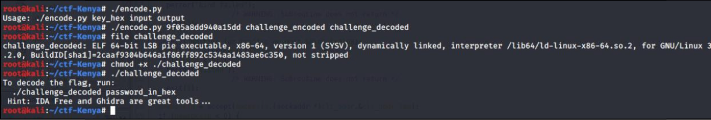
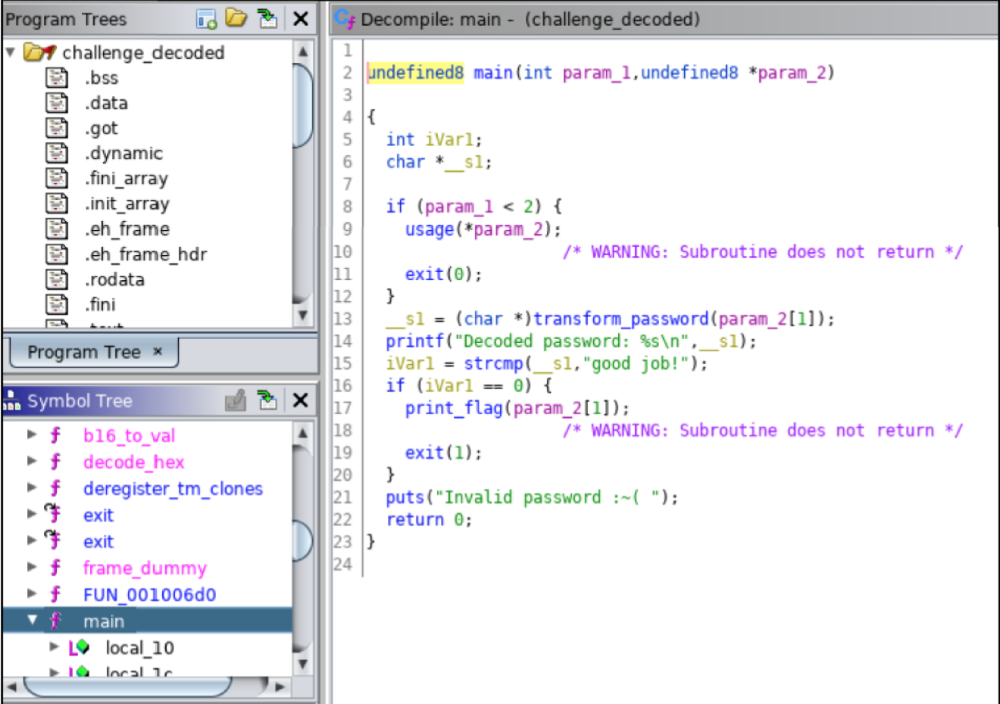
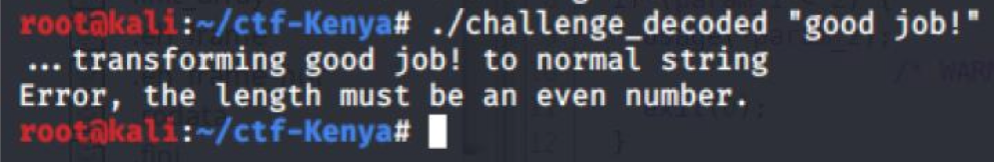
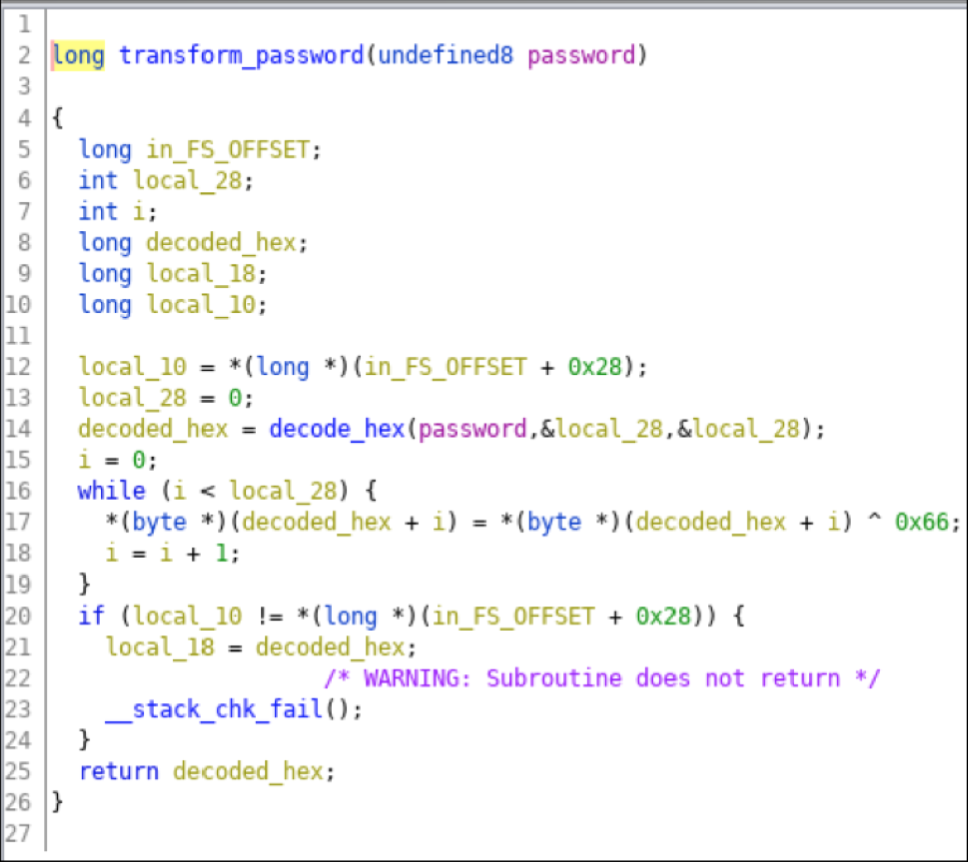
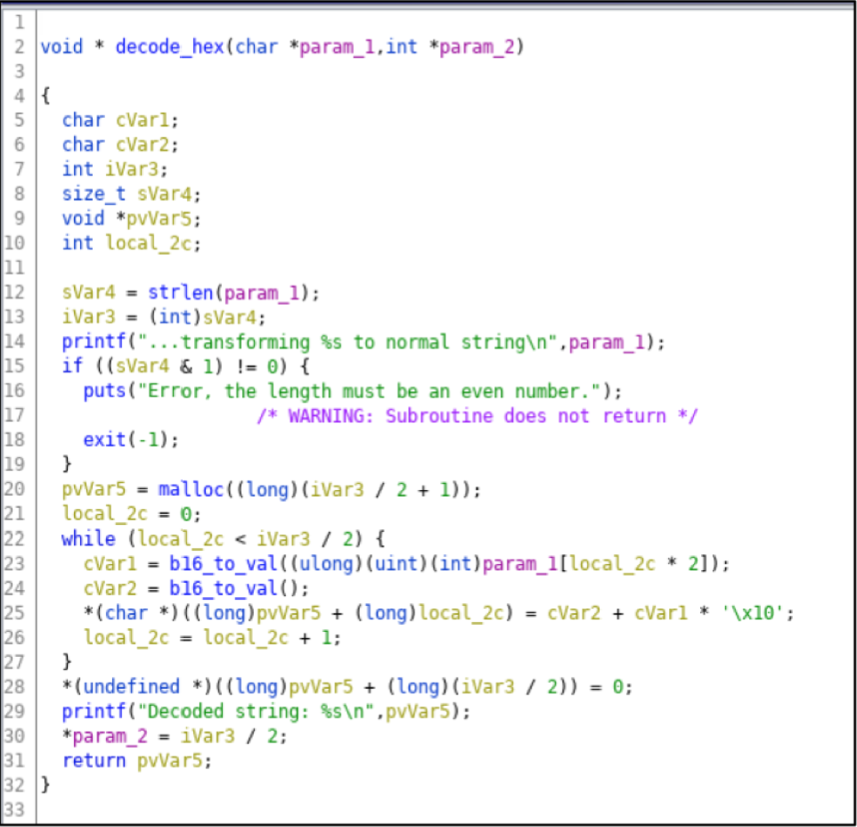
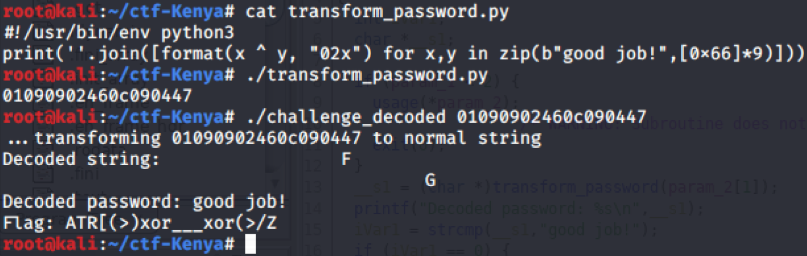

# Solution Write Up to Know Your Header Part 2

The decoding program from the Know your header (Part I) problem was used to decrypt the challenge.

**Figure:** Challenge decoded into an executable elf-64 binary

The decoded binary can be loaded into ghidra to better understand how to decode the flag.

**Figure:** ./challenge_decoded binary loaded into ghidra

It appears that if the decoded input equals "good job!”, then it would display the flag. Not quite! A little more work to do.

**Figure:** ./challenge_decoded “good job!

Also tried inputing the hex encoded "good job!" and it didn't work. Then I saw that the input was xor’ed with 0x66 before being evaluated.

**Figure:** transform_password\(\) input Xor’ed with 0x66

**Figure:** decode_hex\(\) called from transform_password\(\)

With the additional details, I Xor’ed each byte of the hex encoded "good job!" with 0x66. When I used it as input to the program, it gave me the flag!

**Figure:** Source code used to transform_password(), then submit the password to capture the flag

***Note From ATR***

In the above screenshot, we can see that the flag seems to be missing its last bracket. This is because we need to remember that the c program would null-terminate strings, while python does not, so to get the correct solution, you need to add a "\x00" at the end of your string.

=> Flag: `ATR[(>)xor___xor(>)]`
