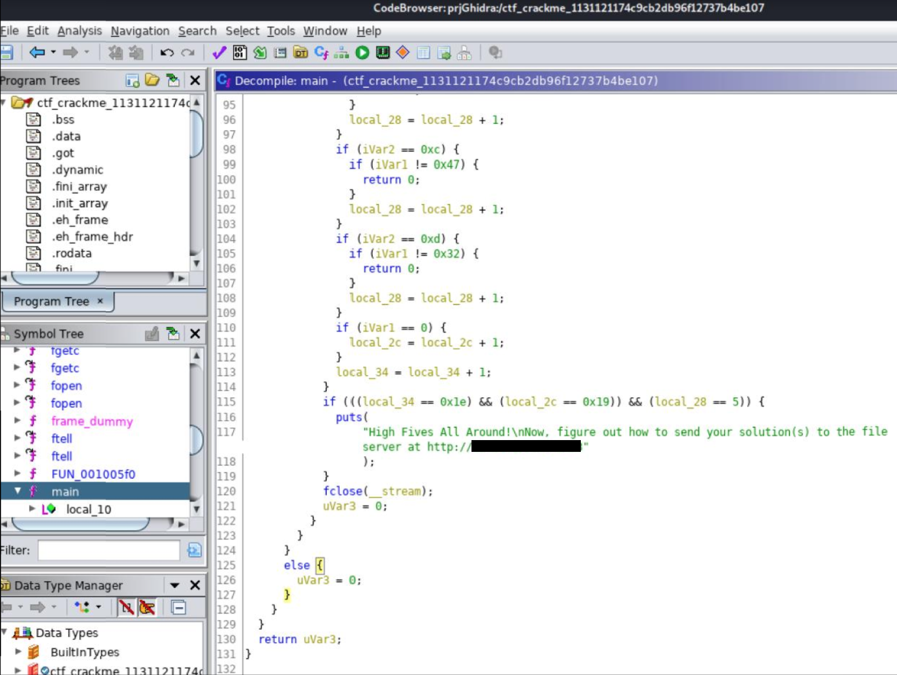
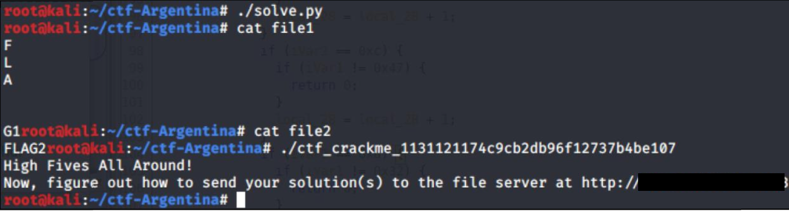
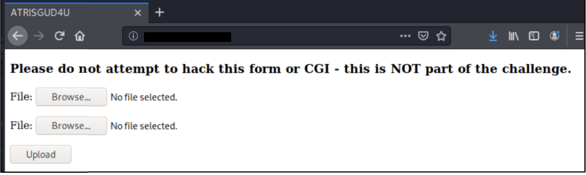
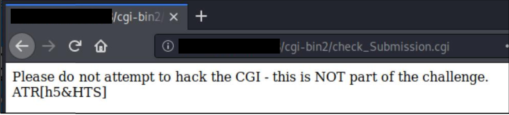

# Solution Write Up to Two's Company

Analyze and reverse the binary with Ghidra
[http://ghidra-sre.org](http://ghidra-sre.org)

**Figure:** Decompiled main() function with Ghidra

```C++
/* WARNING: Unknown calling convention yet parameter storage is locked */ 
int main(void)
{ 
	int read_character; 
	int position; 
	FILE *file_pointer; 
	long current_position; 
	int character_counter; 
	int new_line_counter; 
	int local_2c; 
	int counter; 
	
	character_counter = 0; 
	new_line_counter = 0; 
	local_2c = 0; 
	counter = 0; 
	file_pointer = fopen("file1","r"); 
	if (file_pointer == (FILE *)0x0) { 
		read_character = 0; 
	}
	else { 
	if (file_pointer == (FILE *)0x0) { 
		read_character = -1; 
	} 
	else { 
		while (read_character = fgetc(file_pointer), read_character != -1) { 
		current_position = ftell(file_pointer); 
		position = (int)current_position; 
		if (position == 1) { 
			if (read_character != 0x46) break; 
			counter = counter + 1; 
		} 
		if (position == 3) { 
			if (read_character != 0x4c) { 
				return 0; 
			} 
			counter = counter + 1; 
		} 
		if (position == 5) { 
			if (read_character != 0x41) { 
				return 0; 
			} 
			counter = counter + 1; 
		} 
		if (position == 9) { 
			if (read_character != 0x47) { 
				return 0; 
			} 
			counter = counter + 1; 
		} 
		if (position == 10) { 
			if (read_character != 0x31) { 
				return 0; 
			} 
			counter = counter + 1; 
		}
		if (read_character == 10) { 
			new_line_counter = new_line_counter + 1; 
		} 
		character_counter = character_counter + 1; 
	} 
	if (((character_counter == 10) && (new_line_counter == 5)) && (counter == 5)) { 
		fclose(file_pointer); 
		character_counter = 0; 
		counter = 0; 
		file_pointer = fopen("file2","r"); 
		if (file_pointer == (FILE *)0x0) { 
			read_character = 0; 
		}
		else { 
			if (file_pointer == (FILE *)0x0) { 
				read_character = -1; 
			} 
			else { 
				while (read_character = fgetc(file_pointer), read_character != -1) { 
					current_position = ftell(file_pointer); 
					position = (int)current_position; 
					if (position == 2) { 
						if (read_character != 0x46) { 
							return 0; 
						} 
						counter = counter + 1; 
					} 
					if (position == 4) { 
						if (read_character != 0x4c) { 
							return 0; 
						} 
						counter = counter + 1; 
					} 
					if (position == 6) { 
						if (read_character != 0x41) { 
							return 0; 
						}
						counter = counter + 1; 
					} 
					if (position == 0xc) { 
						if (read_character != 0x47) { 
							return 0; 
						} 
						counter = counter + 1; 
					} 
					if (position == 0xd) { 
						if (read_character != 0x32) { 
							return 0; 
						} 
						counter = counter + 1; 
					} 
					if (read_character == 0) { 
						local_2c = local_2c + 1;
					} 
					character_counter = character_counter + 1; 
				} 
				if (((character_counter == 0x1e) && (local_2c == 0x19)) && (counter == 5)) { 
					puts( "High Fives All Around!\nNow, figure out how to send your 
solution(s) to the fileserver at http://xxx.xxx.xxx.xxx:xxxx"); 
				} 
				fclose(file_pointer); 
				read_character = 0; 
			} 
		} 
	} 
	else { 
		read_character = 0; 
		} 
	} 
} 
return read_character;

```
***Table:*** Decompiled main() function with Ghidra

Script to solve “solve.py”

```python
#!/usr/bin/python 
# Python Script to generate the two files 
# needed to solve the crackme 

flag1=["\n"]*10
flag1[0]=chr(0x46)
flag1[2]=chr(0x4c)
flag1[4]=chr(0x41)
flag1[8]=chr(0x47)
flag1[9]=chr(0x31)

flag2=["\\0"]*30
flag2[1]=chr(0x46)
flag2[3]=chr(0x4c)
flag2[5]=chr(0x41)
flag2[11]=chr(0x47)
flag2[12]=chr(0x32)

f1 = open("file1","w")
for f in flag1:
	f1.write(f)
f1.close()

f2 = open("file2","w")
for f in flag2:
	f2.write(f)
f2.close()
```

Use “solve.py” script to generate file1 and file2, then run “./ctf_crackme_*”


Submit files file1 and file2 to webserver at http://xxx.xxx.xxx.xxx:xxxx


Flag capture

**Figure:** Flag captured after uploading file1 and file2