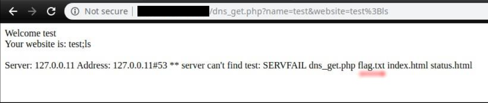
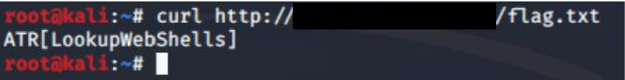

# Solution Write Up to A DNS Query to Rule Them All!

Classic example of command injections. The website call a linux command and display the result without input sanitation. You can use ";" and add a second command

Enter: "test;ls"

**Figure:** Possible flag spotted “flag.txt” by listing files in current directory via “ls” command injection

Now we can see that the flag is located at http://xxx.xxx.xxx.xxx:xxxx/flag.txt

**Figure:** Flag captured by retrieving flag.txt discovered via “ls” file listing